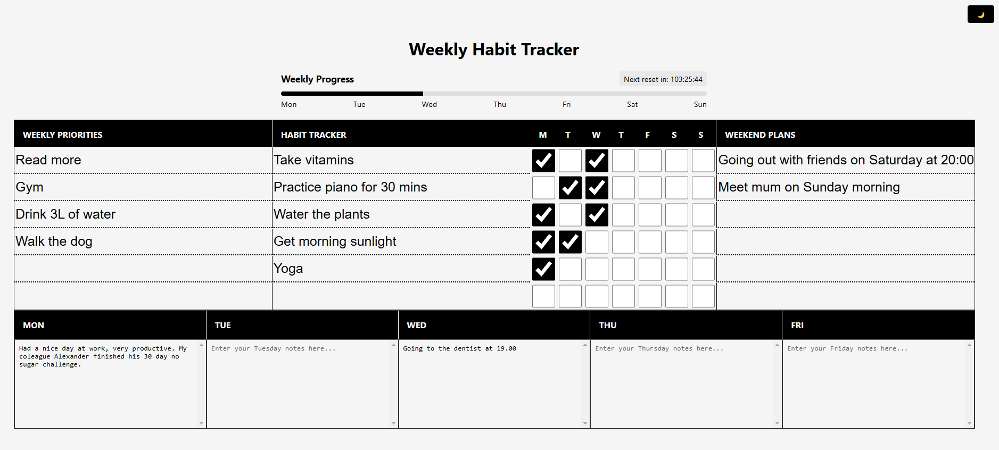
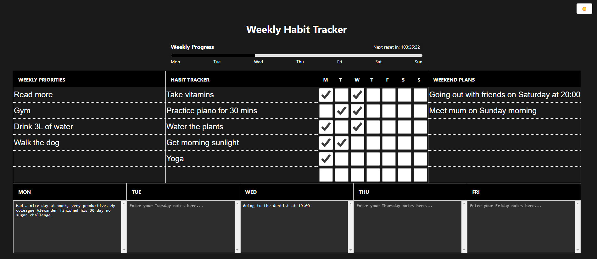

# Weekly Habit Tracker

A simple, elegant web-based habit tracking application that helps you maintain your weekly habits and priorities.

## Features

- 📱 Responsive design
- 🌓 Dark/light theme
- 💾 Automatic saving
- 📊 Weekly progress tracking
- 🔄 Automatic weekly resets
- 📝 Daily notes
- 📱 Works offline

## Images




## Getting Started

1. Clone the repository:

   ```bash
   git clone https://github.com/your-username/weekly-habit-tracker.git
   ```

2. Serve using a local server:
   ```bash
   npx serve
   ```

## Usage

- Toggle between dark/light theme using the button in the top-right corner
- Enter your weekly priorities on the left
- Track daily habits using checkboxes
- Add weekend plans on the right
- Add daily notes in the text areas below
- Progress automatically saves to local storage
- Data automatically resets every Sunday at midnight

## Contributing

Contributions are welcome! Please feel free to submit a Pull Request.

## License

This project is licensed under the MIT License - see the [LICENSE](LICENSE) file for details
